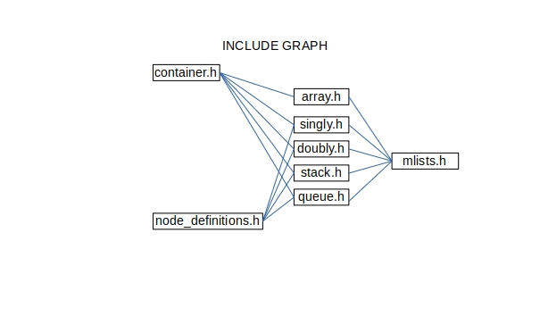
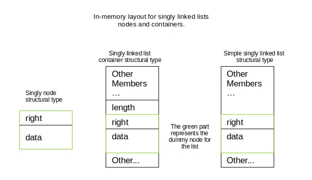
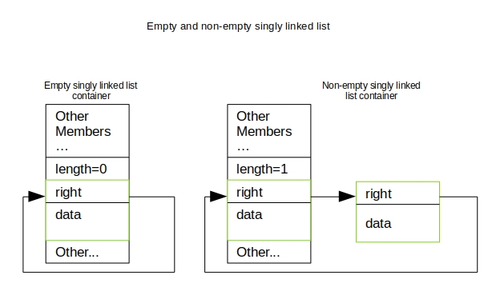

# Macro lists manual

## Overview

This project aims to provide helper macros to ease the implementation of certain

linear data structures like, singly and doubly linked lists, stacks, queues,

and dynamic arrays.

To include the whole collection of data structures include the file 'mlists.h'

into your project. Each data structure can be included independently if desired:

- array.h: dynamic arrays
- singly.h: singly linked lists
- doubly.h: doubly linked lists
- stack.h: stacks
- queue.h: queues

These data structures were designed to work in a cyclic manner, with the porpuse

of easing certain edge cases, and to avoid segfaults in the case of arrays.

Also, every data structure excepting dynamic arrays has 2 sets of macros;

1. To treat the list as an 'explicit container': that is a list that keeps
	track of its own length in-memory.

2. To treat the list in its primitive form: that is a list that doesn't store
	any extra information about its length.

## Brief overview into the project's structure



Here's a brief description of what each header file was created for:

- container.h: Macros to implement lists that save their length in-memory.
- node_definitions.h: Macros to generate singly and doubly linked lists' nodes
	as structural types.
- array.h: Macros to deal with dynamic array containers
- singly.h: singly linked lists.
- doubly.h: doubly linked lists.
- stack.h: stacks.
- queue.h: queues.
- mlists.h: Wrap the whole library for simple inclusion.

---

## How to use?

The intended use consists of mainly 2 steps

1. Create a linear list structural type with the provided macros

2. Generate functions for such type wrapping macros into function definitions.

For example, to create a dynamic array type and an initializer:

```
#include "some_directory/array.h"

// Create an array container type that holds void* pointers:
typedef struct Array
{
	double other;
	ARRAY_CONTAINER(void*)
}Array;

// Wrap a macro into function: ptr is previously allocated in-stack or in-heap
Array init_array(Array* ptr, size_t initial_size, double something) 
{ 
	return a_compound(Array, ptr, initial_size, .other = something);
}
```

Arrays are the easiest to get started on. 

The rest of data structures as for now, are implemented as linked lists:

- singly.h, stack.h, queue.h: implemented as cyclic singly linked lists.
- doubly.h: implemented as cyclic doubly linked list.

That is, stacks, queues and singly linked lsits have *some level* of afinity

with respect to their operations.

So, these are the steps to create any kind of linked list:

1. Create a linear list structural type with the provided macros

	1.1 Create a node type that contains the desired data.

	1.2 Create a container type that contains the list's head and additional data
	
	depending on which type of structure is, for example queues need a pointer to
	
	keep track of their tail.

Let's check this stack example:

```
#include "some_directory/stack.h"

// typedefd node structural type with the alias ptrnode
def_singly_node(ptrnode, void *data; size_t x;);

// typedefd stack container struct type as ptrstack
def_stack_container(ptrstack, ptrnode);

// typedefd simple stack struct type as ptrstack_simple
def_stack(ptrstack_simple, ptrnode);

// let's create an initializer for each type:
static inline void new_ptrnode(ptrstack* ref)
{
	sc_init(ref)
}

static inline void ptrnode_simple new_ptrnode_simp(ptrstack_simple* ref)
{
	// yes this macro is different than the used in above's function
	s_init(ref)
}

// let's create an insertion operation for each type:
static inline void ptrnode_insert(ptrstack* ref, ptrnode* inserting)
{
	sc_add(ref, inserting)
}

static inline void ptrnode_simp_insert(ptrstack_simple* ref, ptrnode* inserting)
{
	// yes this macro is different than the used in above's function
	s_add(ref, inserting)
}

```

## More details on linked lists

It is possible to keep track of a list's length, to do this, you have to use

a macro suffixed with "_container" or "_CONTAINER" when definig the list's type.

This adds an arithmetic type member into the struct, which can only be modified

by certain macros that describe insert/delete operations.

The following illustration shows how the memory layout of a simple and container 

singly linked list and the node structural type *might look like*:



As explained, there's a dummy node in the container, and its expected to be a

node's complete type, this dummy node serves to mark the beginning and end of

a list, that is: the last node's right pointer points to this dummy node and the

right pointer of the dummy points to the first element, as illustrated:



Now let's check the operations described as macros for each linear list type.

First of all, there's some sort of macro-naming convention depending on which

type of list the macro is operating on, and wether the list variable it's an

*explicit container*, that is one that keeps it's length in-memory, or a

*simple container*, that is one that doesn't keep it's length in-memory.

**let's review this naming convention**:

the first letters of a macro represent the data structure on which is intended

to be used for example:

- sl: singly list
- dl: doubly list
- s: stack
- q: queue
- a: array

Followed this preffix, there's a symbol that indicates wether the macro

modifies the in-memory length of a container or not. This symbol is a 'c' for

"container", followed by the preffix formed by the initials of the data structure

and the 'c' symbol, there's an underscore followed by the name of the operation,

some common operations for the data structures:

- add: add an element
- pop: pop an element
- init: initialize given a pointer.

This way is easy to tell which datatype is being used, for example the following

macros would mean:

- slc_add: singly list container add
- s_add: stack add
- qc_pop: stack container pop

and so on.

Notice that although there are common operations among all these data structures,

some of them **don't** require the same type of argument to work.

## Operations cheat table

So now that the important concepts were explained, let's summarize all the

operations for linked lists in a table, (arrays aren't in this table because

those are somewhat *their own thing*, unlike stacks and queues which are something

of a disguised singly linked list).

*Note: simple variant refers to the macro that is intended to be used with*

*lists that don't keep track of their length*

| code/type | stack                 | queue                 | singly                                                             | doubly                                             |
|-----------|-----------------------|-----------------------|--------------------------------------------------------------------|----------------------------------------------------|
| compound  | `(type, stack*, ...)` | `(type, queue*, ...)` | `(type, singly*, ...)`                                             | `(type, doubly*, ...)`                             |
| init      | `(stack*)`            | `(queue*)`            | `(singly)`                                                         | `(doubly*)`                                        |
| add       | `(stack*, node*)`     | `(queue*, node*)`     | `(singly*, node**, node*)`                                         | **x**                                              |
| pop       | `(stack*)`            | `(queue*)`            | `(singly*, node**)`<br>simple variant:<br>`(node**)`               | `(doubly*, node*)`                                 |
| get_pop   | `(stack*, node*)`     | `(queue*, node*)`     | `(singly*, node**, node*)`<br>simple variant:<br>`(node**, node*)` | **x**                                              |
| adda      | **x**                 | **x**                 | **x**                                                              | `(doubly*, node*)`<br>simple variant:<br>`(node*)` |
| addb      | **x**                 | **x**                 | **x**                                                              | `(doubly*, node*)`<br>simple variant:<br>`(node*)` |

## Extra operations and iteration

It's pretty straight forward to get on iterating lists, all data structures

have a macro to get their first node, and some others have a macro to get

their last node, and you can easily use the node type as an iterator.

Here are some important macros that facilitate iteration over lists:

- get_head: get list's first node (works with singly and doubly linked lists).
- get_tail: get lists's last node (only works with doubly linked lists).
- lempty: check wether a list is empty.
- get_len: get the container's lenght.
- mv_next/prev: set a pointer to the next or previous pointer.
- iauto: evaluates if an iterator points to the dummy node.
- cyclic_next/prev: get next/prev node skipping the dummy node.

There's a bit more info in the headers: container.h and node_definitions.h

## Downsides and limitations

This macros were designed to represent the a set of basic operations for each

data structure, that means that there might be some algorithms that cannot be

described only with the provided macros.

A big downside for linked lists is the use of a dummy node, that means that if

a node is a big type, every instance of a list then needs at least `sizeof(node)`

of memory space, however, the tradeoff for this is that there's no need to

check for `NULL` pointers or other conditionals on edge cases like inserting at

the end or the beginning of a linked list.

So far the names in the macros are pretty weak? in the sense that some of them

are way to generic and may cause troubles, like `get_len` for instance.

On the other hand, the intended use is to include these headers into .c

files, like some sort of template?, so there's less chance of having macro

name collisions across multiple files.

The last limitation I see with this kind of implementation is that VLA's with

base size of 0 are not allowed as the last member of a node, since that's not

standard defined to my knowledge, however it seems that these VLA's are allowed

if they have at least 1 element.
